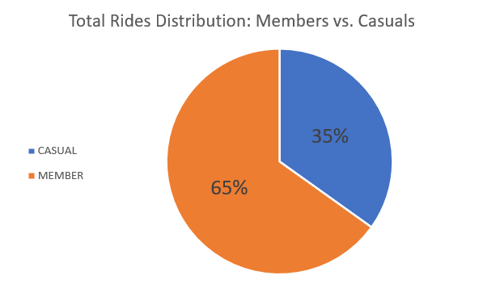
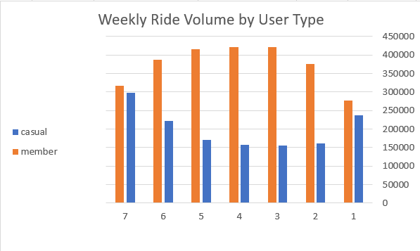
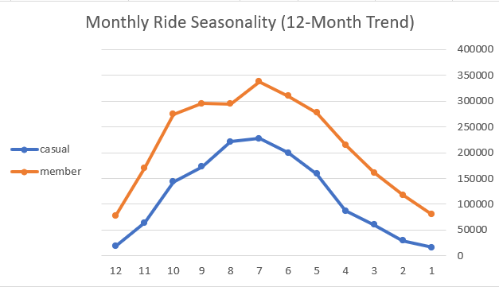

# Cyclistic Bike-Share: Case Study Analysis

---

## Phase 1: Ask

### Project Overview
Cyclistic is a successful bike-share program based in Chicago, featuring a fleet of over 5,800 geotracked bicycles and 600 docking stations. The company offers flexible pricing plans, categorizing users into two main groups:
* **Casual Riders:** Customers who purchase single-ride or full-day passes.
* **Annual Members:** Customers who purchase yearly subscriptions.

Financial analysts at Cyclistic have concluded that annual members are significantly more profitable than casual riders. The Director of Marketing believes that rather than running broad campaigns to attract entirely new customers, the most effective path to future growth is to convert existing casual riders into annual members.

### The Business Task
To analyze historical bike trip data to identify behavioral differences between casual riders and annual members, providing actionable insights that will guide marketing strategies aimed at converting casual riders into profitable annual memberships.

### Key Stakeholders
* **Lily Moreno (Director of Marketing):** Responsible for the development of campaigns and initiatives to promote the bike-share program.
* **Cyclistic Executive Team:** The detail-oriented management team responsible for approving the final recommended marketing program.
* **Cyclistic Marketing Analytics Team:** The data team responsible for collecting, analyzing, and reporting data to guide the overall marketing strategy.

  ---

 ## Phase 2: Prepare
### Data Source & Integrity
The data used for this analysis covers the previous 12 months of Cyclistic trip data (August 2025 – July 2026). The data was downloaded and structured from monthly CSV files provided by Motivate International Inc. under this [license](https://www.divvybikes.com/data-license-agreement).

### ROCCC Analysis Evaluation
* **Reliable:** High reliability; captures millions of real-world tracking metrics from actual system usage.
* **Original:** First-party historical data provided directly by the city bike-share program.
* **Comprehensive:** Contains 12 full months of data, capturing seasonal variations, ride durations, geographic coordinates, and user types.
* **Current:** Reflects recent operational cycles up to mid-2026.
* **Cited:** Sourced transparently from official public datasets.

### Privacy & Security
Data privacy considerations prohibit the use of riders' personally identifiable information (PII). Credit card numbers and home addresses of users have been scrubbed to comply with data privacy regulations.

---

## Phase 3: Process
### Environment & Consolidation
* **Tool Used:** Google BigQuery Sandbox
* **Data Ingestion:** Sourced 12 monthly CSV files via secure Google Drive URIs.
* **Consolidation:** Explicitly defined schemas to prevent type mismatches and merged 12 separate tables into a single master table containing **6,037,968** records using `UNION ALL`.

### Data Cleaning and Transformation
Executed a comprehensive SQL cleaning script that stripped out over 2 million invalid, incomplete, or test records:
* **Removed Null Values:** Filtered out records missing essential geographic data (`start_station_name` and `end_station_name`).
* **Eliminated Anomalies:** Removed maintenance and administrative test rows containing "Test" or "Base" in station names.
* **Corrected Temporal Errors:** Excluded physically impossible trips where `ended_at` occurred before `started_at`.
* **Deduplication:** Applied window functions (`QUALIFY ROW_NUMBER()`) to enforce uniqueness across `ride_id`.

  ---

 ## Phase 4: Analyze

### Analytical Objective
The goal of this phase is to uncover actionable insights regarding the differing usage patterns between annual members and casual riders, utilizing the cleaned dataset of 4,012,680 records.

### SQL Aggregation & Trend Discovery
I utilized Google BigQuery to aggregate the data and extract behavioral trends. The analysis focused on three primary areas:
* **Overall Metrics:** Calculated total ride volume and average ride lengths grouped by user type.
* **Weekly Patterns:** Analyzed ride frequencies and durations across the days of the week to identify commuter versus leisure trends.
* **Seasonality:** Extracted monthly trip volumes to track demand fluctuations throughout the year.

### Key Findings
* **Volume vs. Duration:** Annual members form the core user base, accounting for 65.1% of all trips (2,612,571 rides). However, casual riders spend significantly more time on the bikes per trip, averaging 20.59 minutes compared to the members' 11.89 minutes.
* **Weekly Usage Shift:** Annual member usage remains high during standard weekdays (peaking Tuesday through Thursday at over 400,000 rides), strongly indicating commuter behavior. Conversely, casual rider volume peaks sharply on weekends (Saturday and Sunday), indicating leisure or tourism usage.
* **Seasonal Demand:** Both groups demonstrate peak usage during the summer months (specifically June, July, and August), with member volume topping 337,000 rides in July and casual volume reaching 227,000 rides in the same month.

  ---

  ## Phase 5: Share

### Data Visualizations & Behavioral Insights

#### 1. User Base Distribution
Annual members account for **65.1%** of all completed trips (2,612,571 rides), establishing that subscriber usage represents the primary operational volume of the Cyclistic network.

#### 2. Weekly Commuter vs. Weekend Leisure Trends
Member ride volume remains high and steady Monday through Friday (peaking mid-week between Tuesday and Thursday), confirming consistent commuter utility. Casual ridership spikes sharply on Saturday and Sunday.

#### 3. Monthly Seasonality (12-Month Trend)
Both segments experience their highest demand during the summer months (June through August), with July recording the annual peak. Casual ridership exhibits a steeper drop during the winter months compared to annual members.

---

## Phase 6: Act

### Key Business Takeaways
* **Commuter Foundation:** Annual members rely on Cyclistic for routine, short-duration weekday travel (averaging ~11.9 minutes per trip).
* **High Leisure Engagement:** Casual riders use the service primarily on weekends and during warm seasons, logging significantly longer trips (averaging ~20.6 minutes per trip).

### Strategic Recommendations
1. **Targeted Seasonal Conversions:** Launch digital campaigns and station-specific promotions between May and August targeting high-traffic recreational routes to convert summer casual riders into annual members.
2. **Weekend-to-Weekday Commuter Trial:** Introduce a limited-time promotional pass offering weekend casual users discounted weekday rides to encourage everyday commute adoption.
3. **Trip-Duration Milestone Rewards:** Provide subscription discounts or ride credits to casual riders who frequently log rides exceeding 15 minutes, illustrating the cost efficiency of an annual membership.
